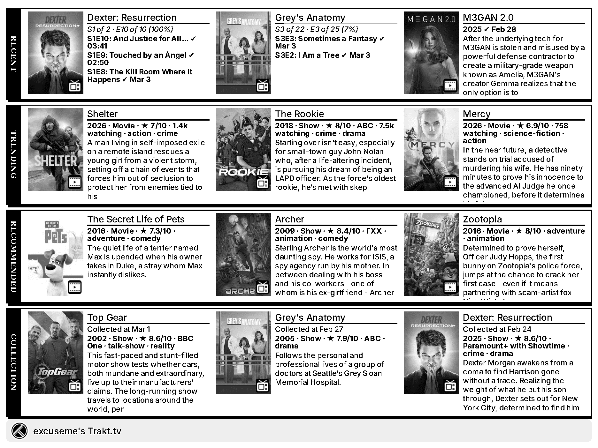

# trmnl-trakt-tv-plugin

<!-- PLUGIN_STATS_START -->
## 🚀 TRMNL Plugin(s)

*Last updated: 2026-03-15 06:52:36 UTC*

##  [Trakt.tv](https://trmnl.com/recipes/245666)

 

### Description
Track your Trakt.tv activity right on your TRMNL device.  
<strong>Available categories</strong> 
· <strong>Collection</strong> — collected media 
· <strong>Continue Watching / Paused</strong> — paused shows &amp; movies <em>(self only)</em> 
· <strong>Now Watching</strong> — currently playing 
· <strong>Recently Watched</strong> — your watch history <em>(self only)</em> 
· <strong>Recommended</strong> — personalized picks from Trakt <em>(self only)</em> 
· <strong>Stats</strong> — watch statistics<em>(self only)</em> 
· <strong>Trending</strong> — what's popular right now 
· <strong>Upcoming</strong> — next episodes &amp; releases <em>(self only)</em> 
· <strong>Watchlist</strong> — saved items  
<strong>Requires Trakt.tv OAuth</strong>   Pick the order you want your categories to appear using the dropdowns. Don't worry about empty categories—they'll be automatically skipped, and the next one with data will show instead.  Icons by <a href="https://www.svgrepo.com">SVG Repo</a>  

---

<!-- PLUGIN_STATS_END -->